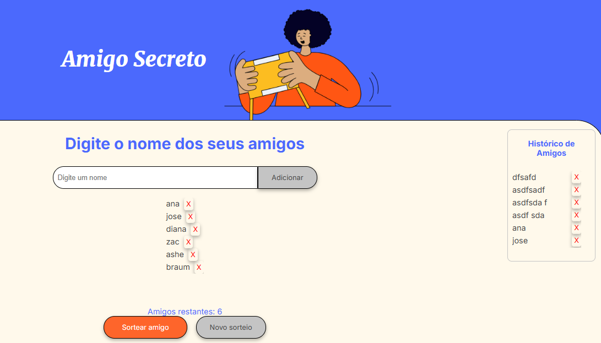

# 🎉 Amigo Secreto



## 🕵️‍♂️ Acesse a aplicação
 [Vizualizar aplicação](https://edivannsantanna.github.io/challenge_amigo_secreto/)

## 📖 Sobre

O projeto "Amigo Secreto" é uma aplicação web que permite aos usuários adicionar nomes de participantes, realizar o sorteio de amigo secreto e visualizar um histórico dos nomes adicionados.


## ✨ Características

- Adição de participantes.
- Sorteio de amigo secreto.
- Exibição do resultado do sorteio.
- Histórico de nomes adicionados.
- Interface amigável e responsiva.

## 🛠️ Tecnologias Utilizadas

- **HTML5**: Estrutura da aplicação.
- **CSS3**: Estilização da aplicação.
- **JavaScript**: Lógica de programação.

## 📂 Estrutura do Projeto

O projeto é composto pelos seguintes arquivos:

- `index.html`: Estrutura HTML da aplicação.
- `style.css`: Estilos CSS para a aplicação.
- `app.js`: Lógica de programação em JavaScript.

## 🛠️ Instalação

1. Clone o repositório para o seu computador:
    ```bash
    git clone https://github.com/edivannsantanna/challenge_amigo_secreto.git
    ```

2. Navegue até o diretório do projeto:
    ```bash
    cd challenge_amigo_secreto
    ```

## 📦 Dependências

Não há dependências externas para este projeto. Todos os arquivos necessários estão incluídos no repositório.

## 🚀 Como Executar

1. Abra o arquivo `index.html` em um navegador web.

2. Adicione os nomes dos participantes no campo de entrada e clique no botão "Adicionar".

3. Após adicionar todos os participantes, clique no botão "Sortear amigo" para realizar o sorteio.

4. O resultado do sorteio será exibido na tela. Você pode limpar o resultado e realizar um novo sorteio clicando no botão "Limpar resultado".

## 🐞 Possíveis Problemas e Soluções

- **Problema**: O botão "Sortear amigo" não está funcionando.
  - **Solução**: Verifique se há participantes suficientes na lista para realizar o sorteio.

- **Problema**: O nome do participante não está sendo adicionado.
  - **Solução**: Certifique-se de que o campo de entrada não está vazio e que o nome não foi adicionado anteriormente.